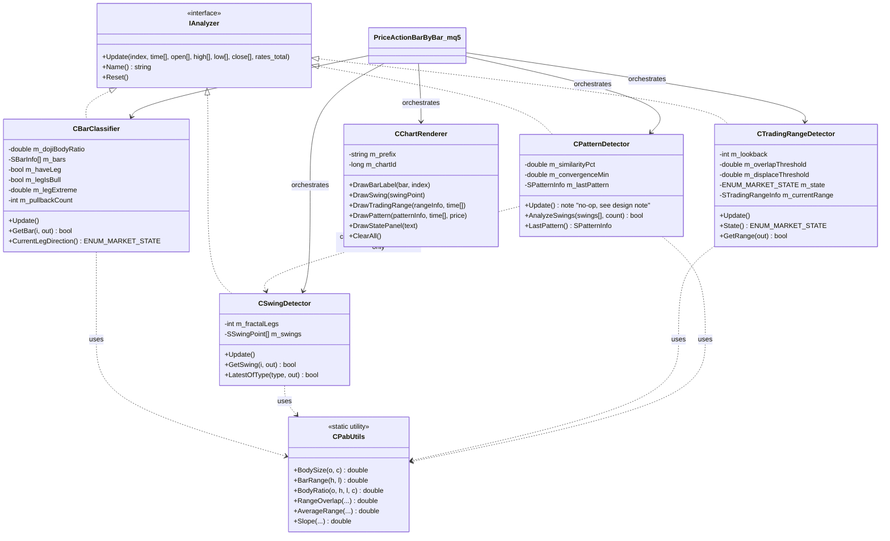

# PriceActionBarByBar

یک اندیکاتور متاتریدر 5 (MQL5) با معماری کاملاً شیء‌گرا برای تحلیل **کندل به کندل** به سبک الگوریتمیک‌شده‌ی *Al Brooks* از کتاب **"Reading Price Charts Bar by Bar"**.

> پلتفرم فعلی: MetaTrader 5 (MQL5). پورت NinjaTrader (NinjaScript/C#) در Phase 2 برنامه‌ریزی شده — به [ROADMAP.md](ROADMAP.md) نگاه کنید.

---

## این پروژه چه‌کار می‌کند؟

هر بار (کندل) به‌صورت مستقل تحلیل می‌شود و در چند لایه‌ی مستقل طبقه‌بندی می‌شود:

| لایه | مسئولیت |
|---|---|
| **Bar Classification** | نوع هر بار (Trend/Doji/Inside/Outside) + شماره‌گذاری پول‌بک (H1/H2/H3+/L1/L2/L3+) |
| **Swing Detection** | شناسایی سقف/کف‌های swing با روش فراکتال N-باری |
| **Trading Range / Trend State** | آیا بازار در حال حاضر رنج است یا ترند (بر اساس overlap و displacement) |
| **Pattern Detection** | الگوهای مبتنی بر swing: Double Top/Bottom، Triangle، Wedge سه‌فشاره، ساختار HH/HL یا LH/LL |
| **Chart Rendering** | تنها لایه‌ای که به چارت دست می‌زند — کاملاً جدا از منطق تحلیلی |

طراحی به‌گونه‌ای است که **منطق تحلیلی هیچ وابستگی‌ای به رسم روی چارت ندارد** — یعنی هر لایه را می‌توان جدا تست کرد یا در آینده (مثلاً پورت NinjaTrader) فقط با نوشتن یک `ChartRenderer` جدید، بقیه‌ی کد را بدون تغییر استفاده کرد.

---

## نصب

1. فایل و پوشه‌ی `Include/` را داخل `MQL5/Indicators/PriceActionBarByBar/` در دیتا فولدر MT5 کپی کنید (Include Path داخل کد به‌صورت نسبی `<Include/...>` نوشته شده، پس ساختار پوشه را حفظ کنید).
2. در MetaEditor کامپایل کنید (`F7`).
3. اندیکاتور را روی چارت بکشید.

```
MQL5/
└── Indicators/
    └── PriceActionBarByBar/
        ├── PriceActionBarByBar.mq5
        └── Include/
            ├── PAB_Types.mqh
            ├── PAB_IAnalyzer.mqh
            ├── PAB_Utils.mqh
            ├── BarClassifier.mqh
            ├── SwingDetector.mqh
            ├── TradingRangeDetector.mqh
            ├── PatternDetector.mqh
            └── ChartRenderer.mqh
```

---

## راهنمای استفاده و مثال‌های عملی

### چطور روی چارت می‌بینیش؟

بعد از اتصال اندیکاتور به چارت، چهار نوع عنصر روی چارت ظاهر می‌شود:

1. **لیبل‌های پول‌بک (H1/H2/H3+/L1/L2/L3+)** — بالای/پایین کندل‌هایی که داخل یک پول‌بک هستند نوشته می‌شود. رنگ قرمز = پول‌بک در حال شکل‌گیری داخل یک leg صعودی (یعنی این‌ها سقف‌های موقت‌اند)، رنگ آبی = پول‌بک داخل leg نزولی.
2. **فلش‌های نارنجی/سبز** — سقف و کف‌های swing تأیید شده (فراکتال).
3. **مستطیل کاهی‌رنگ نقطه‌چین** — بازه‌ی Trading Range فعلی، فقط وقتی بازار رنج تشخیص داده شود ظاهر می‌شود.
4. **متن بنفش** — نام الگوی شناسایی‌شده (مثلاً "Double Top" یا "3-push rising wedge") کنار آخرین swing مربوطه.
5. **پنل بالا-چپ چارت** — وضعیت لحظه‌ای بازار (`Bull Trend` / `Bear Trend` / `Trading Range` / `Transition`) و تعداد swingهای شناسایی‌شده.

### گردش‌کار پیشنهادی برای تحلیل

این ابزار **جایگزین قضاوت شما نیست** — دقیقاً مثل خود کتاب بروکس، هدف این است که چیزهایی که چشم باید هر بار بشمارد را خودکار کند تا شما روی تصمیم‌گیری تمرکز کنید، نه شمارش. یک گردش‌کار پیشنهادی:

1. **اول به پنل وضعیت نگاه کنید.** اگر `Trading Range` است، انتظار سیگنال‌های ضعیف‌تر و برگشت از لبه‌های رنج (مستطیل کاهی) را داشته باشید؛ اگر `Bull/Bear Trend` است، دنبال ورود در جهت ترند در پول‌بک‌ها باشید.
2. **در جهت ترند، دنبال لیبل H2 یا L2 بگردید.** طبق کتاب، دومین پول‌بک در یک leg (H2 در ترند نزولی برای فروش، L2 در ترند صعودی برای خرید) معمولاً محل ورود قابل‌اعتمادتری نسبت به H1/L1 است، چون بازار یک بار تلاش برای ادامه کرده و شکست خورده.
3. **رنگ کندل خود سیگنال را چک کنید.** یک لیبل H2 روی یک بار bear-trend (قرمز/نزولی قوی) قوی‌تر از H2 روی یک doji است — این‌جا هنوز باید خودتان بار را نگاه کنید؛ نسخه‌ی فعلی امتیاز کیفیت سیگنال (signal quality score) ندارد؛ این در Phase 3 اضافه می‌شود.
4. **اگر نام الگویی (متن بنفش) ظاهر شد**، آن را به‌عنوان تأیید یا هشدار اضافه در نظر بگیرید — مثلاً یک "3-push rising wedge" در بالای یک Bull Trend هشدار احتمال برگشت است؛ یک "Double Bottom" کنار پایین مستطیل رنج می‌تواند سیگنال ورود از کف رنج باشد.
5. **مستطیل رنج را برای هدف‌گذاری استفاده کنید** — در بازار رنج، لبه‌ی مقابل مستطیل یک هدف منطقی اولیه است (مشابه منطقی که در پروژه‌ی FM-Indicator برای Measured Move استفاده کردید).

### مثال عملی

فرض کنید روی XAUUSD در H1 هستید و پنل نشان می‌دهد `Bull Trend`:
- قیمت یک سقف جدید می‌زند (swing high با فلش نارنجی رسم می‌شود) → leg جدید صعودی شروع شده، شمارنده‌ی پول‌بک صفر می‌شود.
- دو-سه بار بعد، کندلی می‌بینید که لیبل **L2** روی آن ظاهر شده (توجه: در leg صعودی، پول‌بک‌ها با H1/H2 لیبل می‌خورند — اگر L2 دیدید یعنی در واقع الان leg نزولی در حال ردیابی است، پس این نشانه‌ی برگشت leg است، نه ادامه‌ی صعود).
- اگر همزمان یک "Higher-High/Higher-Low structure" هم به‌عنوان الگو ظاهر شده باشد، ساختار کلی هنوز صعودی تأیید می‌شود.
- تصمیم نهایی خرید/فروش و مدیریت ریسک همچنان بر عهده‌ی شماست — اندیکاتور فقط context را برایتان می‌شمارد.

### تنظیم پارامترها برای تایم‌فریم/نماد خودتان

- روی تایم‌فریم‌های پایین‌تر (M5/M15) یا نمادهای پرنوسان مثل XAUUSD/US30، `InpDojiBodyRatio` را کمی بالاتر ببرید (مثلاً 0.35-0.40) چون noise بیشتری وجود دارد.
- `InpFractalLegs` بزرگ‌تر (مثلاً 3-4) یعنی swingهای کمتر ولی معتبرتر؛ برای اسکالپینگ می‌توانید آن را به 1-2 کاهش دهید.
- اگر مستطیل رنج خیلی زیاد یا خیلی کم ظاهر می‌شود، `InpOverlapThreshold` و `InpDisplaceThreshold` را با هم تنظیم کنید (اولی را کم کنید تا رنج راحت‌تر تشخیص داده شود، دومی را زیاد کنید تا ترند سخت‌تر تشخیص داده شود، یا برعکس).

---

## پارامترها

### Bar Classification
| پارامتر | پیش‌فرض | توضیح |
|---|---|---|
| `InpDojiBodyRatio` | 0.30 | اگر نسبت بدنه به رنج کندل کمتر از این باشد، Doji محسوب می‌شود |

### Swing Detection
| پارامتر | پیش‌فرض | توضیح |
|---|---|---|
| `InpFractalLegs` | 2 | تعداد بار لازم در هر طرف برای تأیید سقف/کف فراکتالی (۲ = فراکتال ۵-باری) |

### Trading Range / Trend State
| پارامتر | پیش‌فرض | توضیح |
|---|---|---|
| `InpRegimeLookback` | 20 | تعداد بار برای محاسبه‌ی امتیاز رنج/ترند |
| `InpOverlapThreshold` | 0.55 | بالاتر از این مقدار overlap → بازار رنج تشخیص داده می‌شود |
| `InpDisplaceThreshold` | 3.0 | جابه‌جایی خالص تقسیم بر میانگین رنج، بالاتر از این → ترند |

### Pattern Detection
| پارامتر | پیش‌فرض | توضیح |
|---|---|---|
| `InpSwingSimilarityPct` | 0.15 | درصد تفاوت مجاز برای این‌که دو swing "برابر" شمرده شوند (Double Top/Bottom) |
| `InpConvergenceMin` | 0.15 | حداقل شیب همگرایی برای تشخیص مثلث/وج |

### Display
نمایش/عدم‌نمایش هر لایه (لیبل پول‌بک، swingها، رنج، الگوها، پنل وضعیت) + رنگ هر عنصر، همگی از طریق ورودی‌های input قابل تنظیم‌اند.

---

## معماری و منطق اندیکاتور

### چرخه‌ی داده

```
OnCalculate()
    │
    ├─► برای هر بار جدید (قدیمی→جدید):
    │       CBarClassifier.Update()   → طبقه‌بندی بار + شماره پول‌بک
    │       CSwingDetector.Update()   → تشخیص فراکتال سقف/کف
    │       CTradingRangeDetector.Update() → امتیازدهی رنج/ترند
    │
    ├─► CPatternDetector.AnalyzeSwings()  ← یک‌بار روی کل لیست swingهای فعلی
    │
    └─► CChartRenderer.*  ← رسم همه‌چیز روی چارت
```

### چرا Pattern Detector عضو "Update()" باری نیست؟

تشخیص الگو ذاتاً تابعی از **لیست swingهاست**، نه بار خام. به‌جای این‌که `CPatternDetector` را وابسته به `CSwingDetector` کنیم (که وابستگی مستقیم بین دو ماژول تحلیلی ایجاد می‌کند)، `CPatternDetector` فقط به نوع داده‌ی `SSwingPoint[]` وابسته است و ارکستریتور (فایل اصلی `.mq5`) این آرایه را بعد از هر بار به‌روزرسانی swingها تحویلش می‌دهد. این یعنی جهت وابستگی همیشه یک‌طرفه و قابل پیش‌بینی می‌ماند.

---

## دیاگرام کلاس‌ها (Mermaid)



---

## اصول طراحی به‌کاررفته

- **Interface / Polymorphism**: هر آنالایزر بار-محور `IAnalyzer` را پیاده می‌کند؛ ارکستریتور می‌تواند بدون دانستن نوع دقیق کلاس، pipeline را اجرا کند.
- **Single Responsibility**: هر کلاس دقیقاً یک کار می‌کند (طبقه‌بندی بار / تشخیص swing / تشخیص رژیم بازار / تشخیص الگو / رسم).
- **Encapsulation**: همه‌ی state داخلی (`m_bars`, `m_swings`, ...) خصوصی است؛ دسترسی فقط از طریق متدهای عمومی مشخص.
- **Separation of Concerns**: منطق تحلیلی هرگز مستقیماً `ObjectCreate` صدا نمی‌زند — همه از `CChartRenderer` عبور می‌کند.
- **Composability**: هر لایه فقط به یک نوع داده‌ی ساده (struct) از لایه‌ی قبل وابسته است، نه به کلاس آن — امکان جایگزینی هر الگوریتم را بدون شکستن بقیه می‌دهد.

---

## راهنمای توسعه‌ی بیشتر

- **الگوریتم جدید برای Bar Classification**: `CBarClassifier::ClassifyType()` را ویرایش کنید؛ بقیه‌ی pipeline بدون تغییر کار می‌کند چون خروجی همان `SBarInfo` است.
- **الگوریتم swing متفاوت** (مثلاً ZigZag به‌جای فراکتال): یک کلاس جدید `IAnalyzer` بسازید که همان `SSwingPoint[]` را تولید کند و در `PriceActionBarByBar.mq5` جایگزین `CSwingDetector` کنید.
- **افزودن الگوی جدید**: در `CPatternDetector::AnalyzeSwings()` یک شاخه‌ی جدید اضافه کنید و `ENUM_PATTERN_TYPE` را در `PAB_Types.mqh` گسترش دهید.
- **پورت NinjaTrader**: فقط `ChartRenderer` معادلش را در NinjaScript بنویسید (Draw.* API)؛ همه‌ی کلاس‌های تحلیلی (`CBarClassifier`, `CSwingDetector`, ...) با تغییرات نحوی جزئی (C# به‌جای MQL5) قابل استفاده‌ی مجددند چون هیچ وابستگی‌ای به API چارت MT5 ندارند.
- **اتصال به FM-Indicator**: `CTradingRangeDetector::State()` و `CPatternDetector::LastPattern()` می‌توانند به‌عنوان context filter برای منطق Measured Move موجود در `ybagheri/FM-indicator` استفاده شوند (مثلاً فقط زمانی MM جدید پروجکت شود که رژیم بازار ترند باشد).

نقشه‌ی راه کامل فازها در [ROADMAP.md](ROADMAP.md).

---

## محدودیت‌های شناخته‌شده (Phase 1)

- تشخیص Trading Range یک **تقریب هندسی/آماری** از قضاوت انسانی بروکس است، نه معادل دقیق آن.
- شماره‌گذاری H2/L2 ساده‌سازی‌شده است و هنوز شرایط دقیق‌تر بروکس (مثل "H2 که از میانه‌ی H1 بالاتر بسته شود") را پیاده نکرده — این در Phase 3 اضافه می‌شود (به ROADMAP نگاه کنید).
- Double Top/Bottom و Wedge فقط بر اساس نزدیکی قیمتی/شیب سنجیده می‌شوند، بدون فیلتر حجم یا context.
- ring buffer داخلی `CBarClassifier`/`CSwingDetector` با شیفت واقعی حافظه پیاده شده (نه circular index)؛ روی اولین لود یک تاریخچه‌ی خیلی طولانی (چند ده‌هزار بار) می‌تواند کند باشد — بهینه‌سازی آن در Phase 2 برنامه‌ریزی شده.

## لایسنس

MIT — به [LICENSE](LICENSE) نگاه کنید.
