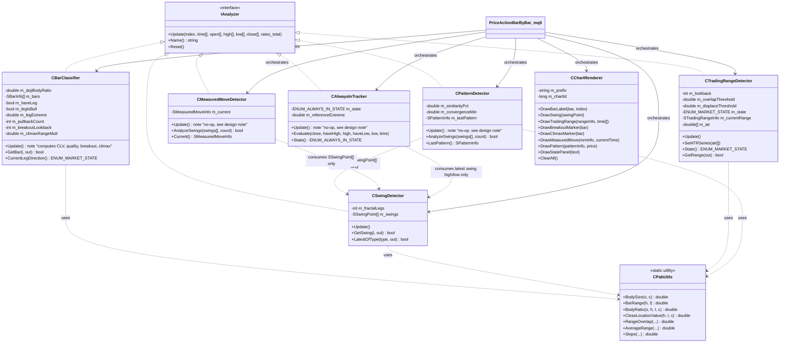

# PriceActionBarByBar

یک اندیکاتور متاتریدر 5 (MQL5) با معماری کاملاً شیء‌گرا برای تحلیل **کندل به کندل** به سبک الگوریتمیک‌شده‌ی *Al Brooks* از کتاب **"Reading Price Charts Bar by Bar"**.

> پلتفرم فعلی: MetaTrader 5 (MQL5). پورت NinjaTrader (NinjaScript/C#) در Phase 4 برنامه‌ریزی شده — به [ROADMAP.md](ROADMAP.md) نگاه کنید.

---

## این پروژه چه‌کار می‌کند؟

هر بار (کندل) به‌صورت مستقل تحلیل می‌شود و در چند لایه‌ی مستقل طبقه‌بندی می‌شود:

| لایه | مسئولیت |
|---|---|
| **Bar Classification** | نوع هر بار (Trend/Doji/Inside/Outside) + شماره‌گذاری پول‌بک (H1/H2/H3+/L1/L2/L3+) + کیفیت سیگنال + Breakout/Climax |
| **Swing Detection** | شناسایی سقف/کف‌های swing با روش فراکتال N-باری |
| **Trading Range / Trend State** | آیا بازار در حال حاضر رنج است یا ترند (بر اساس overlap و displacement، با ATR واقعی) |
| **Always-In (Phase 3)** | وضعیت چسبنده‌ی Long/Short که فقط با شکست ساختاری آخرین swing مخالف عوض می‌شود |
| **Pattern Detection** | الگوهای مبتنی بر swing: Double Top/Bottom، Triangle، Wedge سه‌فشاره، ساختار HH/HL یا LH/LL |
| **Measured Move (Phase 3)** | پروجکشن سبک سه-swing برای هدف‌گذاری — مستقل از موتور کامل‌تر FM-indicator |
| **Chart Rendering** | تنها لایه‌ای که به چارت دست می‌زند — کاملاً جدا از منطق تحلیلی |

طراحی به‌گونه‌ای است که **منطق تحلیلی هیچ وابستگی‌ای به رسم روی چارت ندارد** — یعنی هر لایه را می‌توان جدا تست کرد یا در آینده (مثلاً پورت NinjaTrader) فقط با نوشتن یک `ChartRenderer` جدید، بقیه‌ی کد را بدون تغییر استفاده کرد.

---

## نصب

ساختار ریپو دقیقاً مطابق ساختار دیتافولدر MT5 است — کافی‌ست پوشه‌ی `MQL5/` این پروژه را با پوشه‌ی `MQL5/` دیتافولدر خودتان merge کنید (یا فایل‌ها را دستی به مسیرهای متناظر کپی کنید):

```
price-action-bar-by-bar/
└── MQL5/
    ├── Indicators/
    │   └── PriceActionBarByBar.mq5       ← اندیکاتور اصلی
    ├── Include/
    │   └── PriceActionBarByBar/          ← کلاس‌های مشترک (اندیکاتور + اسکریپت تست از اینجا include می‌کنند)
    │       ├── PAB_Types.mqh
    │       ├── PAB_IAnalyzer.mqh
    │       ├── PAB_Utils.mqh
    │       ├── BarClassifier.mqh
    │       ├── SwingDetector.mqh
    │       ├── TradingRangeDetector.mqh
    │       ├── PatternDetector.mqh
    │       ├── AlwaysInTracker.mqh
    │       ├── MeasuredMoveDetector.mqh
    │       └── ChartRenderer.mqh
    └── Scripts/
        └── PAB_UnitTests.mq5              ← اسکریپت تست مستقل، بدون چارت (Phase 2+3)
```

**مراحل:**
1. محتوای `MQL5/` را داخل دیتافولدر MT5 خودتان کپی کنید (در MT5: File → Open Data Folder، سپس داخل `MQL5/`).
2. در MetaEditor، `Indicators/PriceActionBarByBar.mq5` و `Scripts/PAB_UnitTests.mq5` را کامپایل کنید (`F7` روی هرکدام).
3. اندیکاتور را از Navigator → Indicators روی چارت بکشید.
4. (اختیاری ولی توصیه‌شده) اسکریپت `PAB_UnitTests` را از Navigator → Scripts روی هر چارتی دوبار-کلیک کنید — نتیجه در تب **Experts/Journal** چاپ می‌شود، بدون این‌که چیزی روی چارت رسم شود.

---

## راهنمای استفاده و مثال‌های عملی

### چطور روی چارت می‌بینیش؟

بعد از اتصال اندیکاتور به چارت، چند نوع عنصر روی چارت ظاهر می‌شود:

1. **لیبل‌های پول‌بک (H1/H2/H3+/L1/L2/L3+)** — بالای/پایین کندل‌هایی که داخل یک پول‌بک هستند نوشته می‌شود. رنگ قرمز = پول‌بک در حال شکل‌گیری داخل یک leg صعودی (یعنی این‌ها سقف‌های موقت‌اند)، رنگ آبی = پول‌بک داخل leg نزولی. **(Phase 2)** یک ستاره (`*`) کنار لیبل و فونت بزرگ‌تر یعنی کیفیت سیگنال قوی تشخیص داده شده (بر اساس Close Location Value مطلوب + کم‌عمق‌تر بودن نسبت به پول‌بک قبلی)؛ فونت کوچک‌تر بدون ستاره یعنی کیفیت ضعیف.
2. **فلش‌های نارنجی/سبز** — سقف و کف‌های swing تأیید شده (فراکتال).
3. **مستطیل کاهی‌رنگ نقطه‌چین** — بازه‌ی Trading Range فعلی، فقط وقتی بازار رنج تشخیص داده شود ظاهر می‌شود.
4. **متن بنفش** — نام الگوی شناسایی‌شده (مثلاً "Double Top" یا "3-push rising wedge") کنار آخرین swing مربوطه.
5. **پنل بالا-چپ چارت** — وضعیت لحظه‌ای بازار (`Bull Trend` / `Bear Trend` / `Trading Range` / `Transition`)، وضعیت Always-In (`Long`/`Short`/`None`) و تعداد swingهای شناسایی‌شده.
6. **(Phase 3) مثلث زرد زیر/بالای کندل** — Breakout bar: بار ترند قوی که هم بسته‌شدنش مطلوب است هم یک اکسترمم تازه (N-باری) می‌سازد.
7. **(Phase 3) علامت "X" قرمز** — Climax/Exhaustion bar: کندلی با رنج غیرعادی بزرگ ولی بسته‌شدن ضعیف/بی‌تصمیم — هشدار احتمال برگشت.
8. **(Phase 3) خط نقطه‌چین آبی‌روشن** — هدف Measured Move، از سه‌ swing اخیر پروجکت شده (نسخه‌ی سبک، جایگزین موتور FM-indicator نیست).

### گردش‌کار پیشنهادی برای تحلیل

این ابزار **جایگزین قضاوت شما نیست** — دقیقاً مثل خود کتاب بروکس، هدف این است که چیزهایی که چشم باید هر بار بشمارد را خودکار کند تا شما روی تصمیم‌گیری تمرکز کنید، نه شمارش. یک گردش‌کار پیشنهادی:

1. **اول به پنل وضعیت نگاه کنید.** اگر `Trading Range` است، انتظار سیگنال‌های ضعیف‌تر و برگشت از لبه‌های رنج (مستطیل کاهی) را داشته باشید؛ اگر `Bull/Bear Trend` است، دنبال ورود در جهت ترند در پول‌بک‌ها باشید.
2. **در جهت ترند، دنبال لیبل H2 یا L2 بگردید.** طبق کتاب، دومین پول‌بک در یک leg (H2 در ترند نزولی برای فروش، L2 در ترند صعودی برای خرید) معمولاً محل ورود قابل‌اعتمادتری نسبت به H1/L1 است، چون بازار یک بار تلاش برای ادامه کرده و شکست خورده.
3. **رنگ کندل خود سیگنال را چک کنید، ولی حالا ستاره‌ی کیفیت (Phase 2) و مارکرهای Breakout/Climax (Phase 3) را هم در نظر بگیرید.** یک H2 با `*` (کیفیت قوی) قابل‌اعتمادتر از H2 بدون ستاره است؛ اگر بلافاصله بعد از H2 یک مثلث زرد Breakout ظاهر شد، یعنی بار بعدی هم شرط "بسته‌شدن مطلوب + اکسترمم تازه" را دارد. برعکس، اگر روی یک بار ترند طولانی یک "X" قرمز (Climax) دیدید، مراقب برگشت احتمالی باشید حتی اگر جهت هنوز با ترند هم‌جهت است.
4. **اگر نام الگویی (متن بنفش) ظاهر شد**، آن را به‌عنوان تأیید یا هشدار اضافه در نظر بگیرید — مثلاً یک "3-push rising wedge" در بالای یک Bull Trend هشدار احتمال برگشت است؛ یک "Double Bottom" کنار پایین مستطیل رنج می‌تواند سیگنال ورود از کف رنج باشد.
5. **مستطیل رنج و خط Measured Move را برای هدف‌گذاری استفاده کنید** — در بازار رنج، لبه‌ی مقابل مستطیل یک هدف منطقی اولیه است؛ خط آبی‌روشن Measured Move هدف دیگری از روی سه swing اخیر پیشنهاد می‌دهد (این پروجکشن سبک است — برای تحلیل جدی‌تر Measured Move، از موتور کامل‌تر پروژه‌ی FM-indicator استفاده کنید).
6. **وضعیت Always-In را به‌عنوان فیلتر نهایی استفاده کنید** — اگر پنل `Always-In: Long` نشان می‌دهد ولی سیگنال شما فروش است، این یک هشدار برای احتیاط بیشتر است، نه لزوماً دلیل رد سیگنال؛ Always-In کندتر از پول‌بک‌های H1/H2 حرکت می‌کند و ساختار کلی‌تری را نشان می‌دهد.

### مثال عملی

فرض کنید روی XAUUSD در H1 هستید و پنل نشان می‌دهد `Bull Trend`:
- قیمت یک سقف جدید می‌زند (swing high با فلش نارنجی رسم می‌شود) → leg جدید صعودی شروع شده، شمارنده‌ی پول‌بک صفر می‌شود.
- دو-سه بار بعد، کندلی می‌بینید که لیبل **L2** روی آن ظاهر شده (توجه: در leg صعودی، پول‌بک‌ها با H1/H2 لیبل می‌خورند — اگر L2 دیدید یعنی در واقع الان leg نزولی در حال ردیابی است، پس این نشانه‌ی برگشت leg است، نه ادامه‌ی صعود).
- اگر همزمان یک "Higher-High/Higher-Low structure" هم به‌عنوان الگو ظاهر شده باشد، ساختار کلی هنوز صعودی تأیید می‌شود.
- تصمیم نهایی خرید/فروش و مدیریت ریسک همچنان بر عهده‌ی شماست — اندیکاتور فقط context را برایتان می‌شمارد.

### تنظیم پارامترها برای تایم‌فریم/نماد خودتان

- روی تایم‌فریم‌های پایین‌تر (M5/M15) یا نمادهای پرنوسان مثل XAUUSD/US30، `InpDojiBodyRatio` را کمی بالاتر ببرید (مثلاً 0.35-0.40) چون noise بیشتری وجود دارد.
- `InpFractalLegs` بزرگ‌تر (مثلاً 3-4) یعنی swingهای کمتر ولی معتبرتر؛ برای اسکالپینگ می‌توانید آن را به 1-2 کاهش دهید.
- اگر مستطیل رنج خیلی زیاد یا خیلی کم ظاهر می‌شود، `InpOverlapThreshold` و `InpDisplaceThreshold` را با هم تنظیم کنید (اولی را کم کنید تا رنج راحت‌تر تشخیص داده شود، دومی را زیاد کنید تا ترند سخت‌تر تشخیص داده شود، یا برعکس).

---

## پارامترها

### Bar Classification
| پارامتر | پیش‌فرض | توضیح |
|---|---|---|
| `InpDojiBodyRatio` | 0.30 | اگر نسبت بدنه به رنج کندل کمتر از این باشد، Doji محسوب می‌شود |
| `InpClvFavorableMin` | 0.15 | حداقل قدرمطلق Close Location Value برای این‌که یک بار پول‌بک امتیاز کیفیت بگیرد (Phase 2) |

### Swing Detection
| پارامتر | پیش‌فرض | توضیح |
|---|---|---|
| `InpFractalLegs` | 2 | تعداد بار لازم در هر طرف برای تأیید سقف/کف فراکتالی (۲ = فراکتال ۵-باری) |

### Trading Range / Trend State
| پارامتر | پیش‌فرض | توضیح |
|---|---|---|
| `InpRegimeLookback` | 20 | تعداد بار برای محاسبه‌ی امتیاز رنج/ترند |
| `InpOverlapThreshold` | 0.55 | بالاتر از این مقدار overlap → بازار رنج تشخیص داده می‌شود |
| `InpDisplaceThreshold` | 3.0 | جابه‌جایی خالص تقسیم بر میانگین رنج، بالاتر از این → ترند |
| `InpUseRealATR` | true | استفاده از ATR واقعی MT5 (`iATR`) به‌جای میانگین ساده‌ی داخلی برای نرمال‌سازی جابه‌جایی (Phase 2) |
| `InpATRPeriod` | 14 | دوره‌ی ATR (فقط وقتی `InpUseRealATR = true`) |

### Pattern Detection
| پارامتر | پیش‌فرض | توضیح |
|---|---|---|
| `InpSwingSimilarityPct` | 0.15 | درصد تفاوت مجاز برای این‌که دو swing "برابر" شمرده شوند (Double Top/Bottom) |
| `InpConvergenceMin` | 0.15 | حداقل شیب همگرایی برای تشخیص مثلث/وج |

### Breakout / Climax (Phase 3)
| پارامتر | پیش‌فرض | توضیح |
|---|---|---|
| `InpBreakoutLookback` | 10 | تعداد بار برای چک "اکسترمم تازه" جهت واجد شرایط شدن به‌عنوان Breakout bar |
| `InpBreakoutClvMin` | 0.50 | حداقل قدرمطلق CLV برای بسته‌شدن یک Breakout bar |
| `InpClimaxLookback` | 20 | تعداد بار برای محاسبه‌ی baseline میانگین رنج در تشخیص Climax |
| `InpClimaxRangeMult` | 2.0 | رنج باید حداقل این‌ضربدر میانگین رنج باشد تا Climax تشخیص داده شود |
| `InpClimaxBodyRatioMax` | 0.35 | نسبت بدنه/رنج باید حداکثر این مقدار باشد (بسته‌شدن ضعیف) تا Climax تشخیص داده شود |

### Display
نمایش/عدم‌نمایش هر لایه (لیبل پول‌بک، swingها، رنج، الگوها، Breakout، Climax، خط Measured Move، پنل وضعیت) + رنگ هر عنصر، همگی از طریق ورودی‌های input قابل تنظیم‌اند.

---

## معماری و منطق اندیکاتور

### چرخه‌ی داده

```
OnCalculate()
    │
    ├─► برای هر بار جدید (قدیمی→جدید):
    │       CBarClassifier.Update()   → طبقه‌بندی بار + شماره پول‌بک + Breakout/Climax
    │       CSwingDetector.Update()   → تشخیص فراکتال سقف/کف
    │       CTradingRangeDetector.Update() → امتیازدهی رنج/ترند (با ATR واقعی)
    │
    ├─► CPatternDetector.AnalyzeSwings()      ← یک‌بار روی کل لیست swingهای فعلی
    ├─► CMeasuredMoveDetector.AnalyzeSwings()  ← همان لیست swing، پروجکشن هدف
    ├─► CAlwaysInTracker.Evaluate()            ← close فعلی + آخرین swing high/low
    │
    └─► CChartRenderer.*  ← رسم همه‌چیز روی چارت
```

### چرا Pattern/MeasuredMove/AlwaysIn عضو "Update()" باری نیستند؟

تشخیص الگو، پروجکشن Measured Move، و وضعیت Always-In همگی ذاتاً تابعی از **لیست swingهاست**، نه بار خام. به‌جای این‌که این کلاس‌ها را مستقیماً وابسته به `CSwingDetector` کنیم (که وابستگی مستقیم بین ماژول‌های تحلیلی ایجاد می‌کند)، هرکدام فقط به نوع داده‌ی `SSwingPoint[]` (یا مقادیر ساده‌ی close/swing price) وابسته‌اند و ارکستریتور (فایل اصلی `.mq5`) این داده را بعد از هر بار به‌روزرسانی swingها تحویلشان می‌دهد. این یعنی جهت وابستگی همیشه یک‌طرفه و قابل پیش‌بینی می‌ماند.

---

## دیاگرام کلاس‌ها (Mermaid)



---

## اصول طراحی به‌کاررفته

- **Interface / Polymorphism**: هر آنالایزر بار-محور `IAnalyzer` را پیاده می‌کند؛ ارکستریتور می‌تواند بدون دانستن نوع دقیق کلاس، pipeline را اجرا کند.
- **Single Responsibility**: هر کلاس دقیقاً یک کار می‌کند (طبقه‌بندی بار / تشخیص swing / تشخیص رژیم بازار / تشخیص الگو / رسم).
- **Encapsulation**: همه‌ی state داخلی (`m_bars`, `m_swings`, ...) خصوصی است؛ دسترسی فقط از طریق متدهای عمومی مشخص.
- **Separation of Concerns**: منطق تحلیلی هرگز مستقیماً `ObjectCreate` صدا نمی‌زند — همه از `CChartRenderer` عبور می‌کند.
- **Composability**: هر لایه فقط به یک نوع داده‌ی ساده (struct) از لایه‌ی قبل وابسته است، نه به کلاس آن — امکان جایگزینی هر الگوریتم را بدون شکستن بقیه می‌دهد.

---

## راهنمای توسعه‌ی بیشتر

- **الگوریتم جدید برای Bar Classification**: `CBarClassifier::ClassifyType()` را ویرایش کنید؛ بقیه‌ی pipeline بدون تغییر کار می‌کند چون خروجی همان `SBarInfo` است.
- **الگوریتم swing متفاوت** (مثلاً ZigZag به‌جای فراکتال): یک کلاس جدید `IAnalyzer` بسازید که همان `SSwingPoint[]` را تولید کند و در `PriceActionBarByBar.mq5` جایگزین `CSwingDetector` کنید.
- **افزودن الگوی جدید**: در `CPatternDetector::AnalyzeSwings()` یک شاخه‌ی جدید اضافه کنید و `ENUM_PATTERN_TYPE` را در `PAB_Types.mqh` گسترش دهید.
- **پورت NinjaTrader**: فقط `ChartRenderer` معادلش را در NinjaScript بنویسید (Draw.* API)؛ همه‌ی کلاس‌های تحلیلی (`CBarClassifier`, `CSwingDetector`, ...) با تغییرات نحوی جزئی (C# به‌جای MQL5) قابل استفاده‌ی مجددند چون هیچ وابستگی‌ای به API چارت MT5 ندارند.
- **اتصال به FM-Indicator**: `CTradingRangeDetector::State()` و `CAlwaysInTracker::State()` می‌توانند به‌عنوان context filter برای منطق Measured Move موجود در `ybagheri/FM-indicator` استفاده شوند (مثلاً فقط زمانی MM جدید پروجکت شود که رژیم بازار ترند باشد و Always-In هم‌جهت باشد)؛ `CPatternDetector::LastPattern()` می‌تواند برای تأیید/رد زون‌های reversal آن پروژه استفاده شود. `CMeasuredMoveDetector` این پروژه عمداً سبک نگه داشته شده — برای پروجکشن جدی، از موتور کامل‌تر FM-indicator استفاده کنید (Phase 5).

نقشه‌ی راه کامل فازها در [ROADMAP.md](ROADMAP.md).

---

## اسکریپت Unit Test (Phase 2+3)

`MQL5/Scripts/PAB_UnitTests.mq5` یک اسکریپت مستقل و بدون-چارت است که کلاس‌های تحلیلی را با داده‌های OHLC دستی‌ساخته‌شده تست می‌کند (طبقه‌بندی بار، شمارش H1/H2، تشخیص swing، تشخیص رنج، تشخیص الگو، Breakout/Climax، Always-In، Measured Move — ۸ گروه تست). بعد از هر تغییر در `Include/PriceActionBarByBar/*.mqh` این اسکریپت را اجرا کنید تا مطمئن شوید چیزی نشکسته — خروجی PASS/FAIL در تب Experts/Journal چاپ می‌شود. این جایگزین بک‌تست واقعی روی داده‌ی تاریخی نیست (که نیاز به Strategy Tester و داده‌ی واقعی نماد دارد)، بلکه یک regression check سریع و قطعی است.

---

## محدودیت‌های شناخته‌شده (به‌روزشده — Phase 3)

- تشخیص Trading Range همچنان یک **تقریب هندسی/آماری** از قضاوت انسانی بروکس است، نه معادل دقیق آن (هرچند حالا با ATR واقعی نرمال‌سازی می‌شود).
- امتیاز کیفیت H2/L2 (Phase 2) یک **پروکسی عینی ساده‌شده** است (CLV + کم‌عمق‌تر بودن نسبت به پول‌بک قبلی)، نه معادل کامل شرایط دقیق‌تری که بروکس در کتاب توضیح می‌دهد.
- Double Top/Bottom و Wedge فقط بر اساس نزدیکی قیمتی/شیب سنجیده می‌شوند، بدون فیلتر حجم یا context.
- **Measured Move (Phase 3)** یک پروجکشن سبک سه-swing است، نه معادل موتور چندحالته‌ی FM-indicator (که lifecycle state، session mode، و MAE/MFE export دارد). برای استفاده‌ی جدی، به Phase 5 (یکپارچه‌سازی) نگاه کنید.
- **Always-In (Phase 3)** فقط از آخرین swing تأییدشده استفاده می‌کند؛ روی نمادها/تایم‌فریم‌هایی با نویز زیاد ممکن است زودتر از حد انتظار flip کند — `InpFractalLegs` بزرگ‌تر می‌تواند این را کاهش دهد.
- ~~ring buffer با شیفت حافظه~~ — در Phase 2 به circular buffer با push در O(1) تبدیل شد؛ این محدودیت رفع شده است.
- ~~staleness باگ در رندر Pattern/Measured Move~~ — در Phase 3 رفع شد؛ این کلاس‌ها حالا `datetime` پایدار به‌جای `barIndex` ذخیره می‌کنند.

## لایسنس

MIT — به [LICENSE](LICENSE) نگاه کنید.
